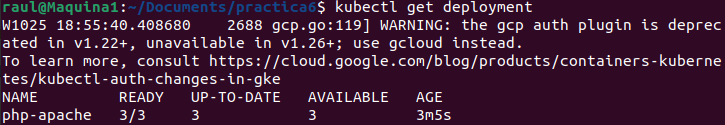

# Entrega 3 de la práctica 6 
- # Objetivo

El objetivo de esta entrega es realizar una prueba de estrés a un cluster de kubernetes previamente desplegado. 
La prueba de rendimiento se va a realizar por medio de la herramienta LOCUST. Se van a desplegar pods de locust dentro del cluster a probar, el cual ya tiene desplegados los pods de trabajo encargados de servir la página web. 

Esta prueba se realiza para comprobar si el cluster escala correctamente ante las diferentes cargas de trabajo.

- # Creación cluster
Para poder realziar la prueba de rendimiento es necedsario configurar en la nube de google un cluster de kubernetes donde desplegar los pods. En este paso no solo se va a crear el cluster, si no que se va a configuar para que pueda escalar de forma automática de acuerdo con la demanda que tenga.

Para ello se ejecutan los siguientes comandos:

Cambio de la zona de cómputo

 

Creación del cluster

Resultado:


- ## Escalado cluster
Una vez que se ha creado el cluster es necesario configurarlo para que pueda escañar de forma horizontal y vertical, para ello se van a llevar a cabo los siguentes pasos:
- ### Escalado de pods con HPA
Para que tengan alta disponibilidad los pods

```
kubectl get deployment
```
Resultado que muestra el número de despliegues que se tienen actualmente. Se puede comprobar que todos los pods se encuentran levantados y disponibles




Se aplica HPA
```
kubectl autoscale deployment php-apache --cpu-percent=50 --min="1" --max="3"

```
De esta forma se establece que un pod se replice cuando se supere el 50% de la CPU del nodo en el que se encuentre. Además se establece que como mínimo debe de existir una instancia de ese pod, y como máximo 3.
Con el siguente comando se comprueba que efectivamente los cambios han surtido efecto
```
kubectl get hpa
```


- ### Autoescalado del cluster
En esta parte se va a configurar el número de nodos que puede escalar el cluster, y cuando lo debe de hacer.
Con el siguiente comando se va a establecer que el cluster va a tener como mínimo un nodo, y como máximo 5.
Además se le establece que la forma de decidir cuando escalar es la de por defecto "balanced"

```
gcloud container clusters update cluster-kubernetes --enable-autoscaling --min-nodes=1 --max-nodes=5
```
El cambio ha sido efectivo


- # Creación imagen Locust
Una vez que se ha creado el cluster en la nube de google el siguiente paso para poder realizar la práctica es crear un contenedor docker que tenga todas las herramientas y librerias necesarias para que Locust pueda ejecutarse.


