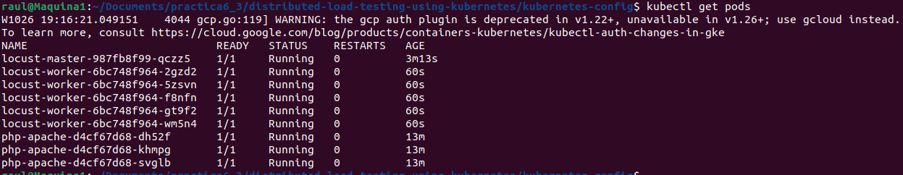

# Entrega 3 de la práctica 6 
- # Objetivo

El objetivo de esta entrega es realizar una prueba de estrés a un cluster de kubernetes previamente desplegado. 
La prueba de rendimiento se va a realizar por medio de la herramienta LOCUST. Se van a desplegar pods de locust dentro del cluster a probar, el cual ya tiene desplegados los pods de trabajo encargados de servir la página web. 

Esta prueba se realiza para comprobar si el cluster escala correctamente ante las diferentes cargas de trabajo.

- ## Pasos para la construcción del contenedor
El contenedor no se va a construir en local, si no que se va a contruir en la nube de google. De esta forma no es necesario subir la imagen a posteri, si no que la imagen ya se encuentra disponible en el repository del proyecto.
El comando a ejecutar es el siguiente:


    
El resultado obtenido es el siguente:


Aparece el contenedor creado en la nube de google


- ## Creación imagen Locust
En este paso se va a crear el contenedor docker que con todas las herramientas y librerias necesarias para que Locust pueda ejecutarse.
Una imagen compilada de este contenendedor es la que se va a desplegar dentro del cluster, tanto para los pods worker como para los pods slave

El fichero dockerfile que describe el contenedor es el siguiente:

```
# Start with a base Python 3.7.2 image
FROM python:3.7.2

# Add the licenses for third party software and libraries
ADD licenses /licenses

# Add the external tasks directory into /tasks
ADD locust-tasks /locust-tasks

# Install the required dependencies via pip
RUN pip install -r /locust-tasks/requirements.txt

# Expose the required Locust ports
EXPOSE 5557 5558 8089

# Set script to be executable
RUN chmod 755 /locust-tasks/run.sh

# Start Locust using LOCUS_OPTS environment variable
ENTRYPOINT ["/locust-tasks/run.sh"] 
```
Es necesario añadir este contenedor al container registry del proyecto de google cloud, así como compilar el contenedor para generar una imagen usable para desplegar un pod de kubernetes.
Por ello se ejecuta el sigueinte comando:

```
gcloud builds submit --tag gcr.io/kubernetes-366509/locust-tasks:latest .
```


- # Ficheros deployment
En esta práctica se van a realizar tres despligues, uno para los pods con el servidor apache y con la página web (workers), otro con los pods encargados de realizar la prueba de rendimiento y un último (master) orquestador de la prueba de rendimiento.

El fichero .yaml con la descripción del despliegue de los pods "workers" es el siguiente:

```
apiVersion: apps/v1
    kind: Deployment
    metadata:
    name: php-apache
    spec:
    selector:
        matchLabels:
        run: php-apache
    replicas: 3
    template:
        metadata:
        labels:
            run: php-apache
        spec:
        containers:
        - name: php-apache
            image: k8s.gcr.io/hpa-example
            ports:
            - containerPort: 80
            resources:
            limits:
                cpu: 500m
            requests:
                cpu: 200m
    ---
    apiVersion: v1
    kind: Service
    metadata:
    name: php-apache
    labels:
        run: php-apache
    spec:
    ports:
    - port: 80
    selector:
        run: php-apache
```
El fichero .yamal con la descripción de los nodos de trabajo es el siguiente:

```
# Copyright 2015 Google Inc. All rights reserved.
#
# Licensed under the Apache License, Version 2.0 (the "License");
# you may not use this file except in compliance with the License.
# You may obtain a copy of the License at
#
#     http://www.apache.org/licenses/LICENSE-2.0
#
# Unless required by applicable law or agreed to in writing, software
# distributed under the License is distributed on an "AS IS" BASIS,
# WITHOUT WARRANTIES OR CONDITIONS OF ANY KIND, either express or implied.
# See the License for the specific language governing permissions and
# limitations under the License.

apiVersion: "apps/v1"
kind: "Deployment"
metadata:
  name: locust-worker
  labels:
    name: locust-worker
spec:
  replicas: 5
  selector:
    matchLabels:
      app: locust-worker
  template:
    metadata:
      labels:
        app: locust-worker
    spec:
      containers:
        - name: locust-worker
          image: gcr.io/kubernetes-366509/locust-tasks:latest
          env:
            - name: LOCUST_MODE
              value: worker
            - name: LOCUST_MASTER
              value: locust-master
            - name: TARGET_HOST
              value: http://php-apache/

```

El fichero .yaml con la descripción del nodo orquestador de la prueba de rendimiento es:
```
# Copyright 2015 Google Inc. All rights reserved.
#
# Licensed under the Apache License, Version 2.0 (the "License");
# you may not use this file except in compliance with the License.
# You may obtain a copy of the License at
#
#     http://www.apache.org/licenses/LICENSE-2.0
#
# Unless required by applicable law or agreed to in writing, software
# distributed under the License is distributed on an "AS IS" BASIS,
# WITHOUT WARRANTIES OR CONDITIONS OF ANY KIND, either express or implied.
# See the License for the specific language governing permissions and
# limitations under the License.


apiVersion: "apps/v1"
kind: "Deployment"
metadata:
  name: locust-master
  labels:
    name: locust-master
spec:
  replicas: 1
  selector:
    matchLabels:
      app: locust-master
  template:
    metadata:
      labels:
        app: locust-master
    spec:
      containers:
        - name: locust-master
          image: gcr.io/kubernetes-366509/locust-tasks:latest
          env:
            - name: LOCUST_MODE
              value: master
            - name: TARGET_HOST
              value: http://php-apache/
          ports:
            - name: loc-master-web
              containerPort: 8089
              protocol: TCP
            - name: loc-master-p1
              containerPort: 5557
              protocol: TCP
            - name: loc-master-p2
              containerPort: 5558
              protocol: TCP
```              

- # Creación cluster
Para poder realziar la prueba de rendimiento es necesario configurar en la nube de google un cluster de kubernetes donde desplegar los pods. En este paso no solo se va a crear el cluster, si no que se va a configuar para que pueda escalar de forma automática de acuerdo con la demanda que tenga.

Para ello se ejecutan los siguientes comandos:

Cambio de la zona de cómputo

 

Creación del cluster

Resultado:


Ahora que se ha creado el cluster es hora de realizar el primer despliegue, en este caso serán los pods de trabajo
```
kubectl apply -f php-apache
```

El resultado es el siguiente:


- ## Escalado cluster
Una vez que se ha creado y se han desplegado los pods de trabajo es necesario configurar el despliegue para que pueda escañar de forma horizontal y vertical, para ello se van a llevar a cabo los siguentes pasos:

- ### Escalado de pods con HPA
Para que tengan alta disponibilidad los pods

```
kubectl get deployment
```
Resultado que muestra el número de despliegues que se tienen actualmente. Se puede comprobar que todos los pods se encuentran levantados y disponibles


Se aplica HPA
```
kubectl autoscale deployment php-apache --cpu-percent=50 --min="1" --max="3"

```
De esta forma se establece que un pod se replice cuando se supere el 50% de la CPU del nodo en el que se encuentre. Además se establece que como mínimo debe de existir una instancia de ese pod, y como máximo 3.
Con el siguente comando se comprueba que efectivamente los cambios han surtido efecto
```
kubectl get hpa
```


- ### Autoescalado del cluster
En esta parte se va a configurar el número de nodos que puede escalar el cluster, y cuando lo debe de hacer.
Con el siguiente comando se va a establecer que el cluster va a tener como mínimo un nodo, y como máximo 5.
Además se le establece que la forma de decidir cuando escalar es la de por defecto "balanced"

```
gcloud container clusters update cluster-kubernetes --enable-autoscaling --min-nodes=1 --max-nodes=5
```
El cambio ha sido efectivo


- # Despliegue master 
Con todo ya configurado y listo para realizar la prueba de rendimiento, se despliega el nodo de orquestación con los siguientes comandos:
```
kubectl apply -f  locust-master-controller.yaml
kubectl apply -f locust-master-service.yaml
```


- # Despliegue slaves
Por último va a ser necesario desplegar los pods encargados de ejecutar las órdenes enviadas por el master

```
kubectl apply -f locust-worker-controller.yaml
```


- # Resutlados
Como se puede comprobar en la imagen inferior los pods funcionan correctamentem, y la prueba de rendimiento se está realizando.


Para poder visualizar los datos de forma más estética, se puede acceder al servidor de locust.
Para ello es necesario conocer la dirección Ip del este pod con el siguiente comando:
```
kubectl get svc locust-master -o yaml | yq '.status.loadBalancer.ingress[0].ip'
```


