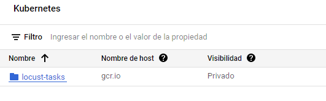
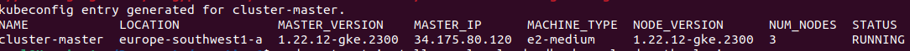

# Entrega 2 de la práctica 6 
- # Objetivo
El objetivo de esta entrega es realizar una prueba de estrés a un cluster de kubernetes previamente desplegado. 
Para ello se va a crear un contenedor Docker con toda la funcionalidad incorporada.
El despliegue del contenedor se va a realizar por medio de un Job de Kubernetes dentro del mismo cluster creado previamente.

- # Contenedor Docker
El contenedor Docker requerido debe de poder ejecutar comando ab, es decir que debe de tener instalada la librería apache2.
El fichero dockerfile con la descripción del contenedor es el siguiente:

```
FROM ubuntu:latest

RUN apt-get -y update; \
    apt-get -y upgrade; \
    apt-get -y install apt-utils \
RUN apt install apache2-utils
```

- ## Pasos para la construcción del contenedor
El contenedor no se va a construir en local, si no que se va a contruir en la nube de google. De esta forma no es necesario subir la imagen a posteri, si no que la imagen ya se encuentra disponible en el repository del proyecto.
El comando a ejecutar es el siguiente:


    
El resultado obtenido es el siguente:


Aparece el contenedor creado en la nube de google



- # Cluster master
Antes de poder desplegar la imagen que se acaba de crear, es necesario desplegar el cluster objetivo de la prueba de rendimiento.
Para ello se va a emplear el siguente fichero .yaml como descripción del cluster:

    
    apiVersion: apps/v1
    kind: Deployment
    metadata:
    name: php-apache
    spec:
    selector:
        matchLabels:
        run: php-apache
    replicas: 3
    template:
        metadata:
        labels:
            run: php-apache
        spec:
        containers:
        - name: php-apache
            image: k8s.gcr.io/hpa-example
            ports:
            - containerPort: 80
            resources:
            limits:
                cpu: 500m
            requests:
                cpu: 200m
    ---
    apiVersion: v1
    kind: Service
    metadata:
    name: php-apache
    labels:
        run: php-apache
    spec:
    ports:
    - port: 80
    selector:
        run: php-apache
    
Además se van a seguir los siguientes pasos para la creación del cluster
   
 - ## Creación cluster
 Antes de poder desplegar los pods, es necesario crear un cluster con un número de nodos determinado. Para ello se ejecutan los siguientes comandos:

Cambio de la zona de cómputo

 

Creación del cluster

Resultado:


Una vex se ha creado el cluster, se despliegan los pods en los nodos con el siguiente comando


Servicios creados:


- ## Escalado cluster
Una vez que se ha creado esl cluster es necesario configurarlo para que pueda escañar de forma horizontal y vertical, para ello se van a llevar a cabo los siguentes pasos:
- ### Escalado de pods con HPA
Para que tengan alta disponibilidad los pods
```
kubectl get deployment
```
Resultado que muestra el número de despliegues que se tienen actualmente. Se puede comprobar que todos los pods se encuentran levantados y disponibles


```
kubectl get deployment
```

Se aplica HPA
```
kubectl autoscale deployment php-apache --cpu-percent=50 --min="1" --max="3"

```
De esta forma se establece que un pod se replice cuando se supere el 50% de la CPU del nodo en el que se encuentre. Además se establece que como mínimo debe de existir una instancia de ese pod, y como máximo 3.
Con el siguente comando se comprueba que efectivamente los cambios han surtido efecto
```
kubectl get hpa
```


- ### Autoescalado del cluster
En esta parte se va a configurar el número de nodos que puede escalar el cluster, y cuando lo debe de hacer.
Con el siguiente comando se va a establecer que el cluster va a tener como mínimo un nodo, y como máximo 5.
Además se le establece que la forma de decidir cuando escalar es la de por defecto "balanced"

```
gcloud container clusters update cluster-kubernetes --enable-autoscaling --min-nodes=1 --max-nodes=5
```
El cambio ha sido efectivo


- # Pods slave
Ahora que ya se ha desplegado el cluster que sirve el contenido web, se va a proceder a crear el cluster que realiza la prueba de rendimiento.
Este cluster despliega 5 pods con el contenedor que se ha creado en el primer apartado.
El fichero .yaml con la descripción del despliegue es el siguiente:
 ```
   apiVersion: batch/v1beta1
    kind: CronJob
    metadata:
    name: mycronjob
    spec:
    schedule: "*/5 * * * *"
    jobTemplate:
        spec:
        parallelism: 5
        template:
            spec:
            containers:
            - name: ab
                image: gcr.io/kubernetes-366509/locust-tasks:latest
                command: ["ab","-n","10000","-c","10","http://php-apache/"]
            restartPolicy: Never
        backoffLimit: 2
    
    concurrencyPolicy: Allow 

    ```
- ## Despliegue pods slave
Una vez se tiene el contenedor en el registry de GCE y el fichero del despligue correctamente configurado, se puede proceder a realizar el despliegue del job.
Para ello se ejecuta el siguiente comando
```
kubectl apply -f job.yaml
```
Efectivamente, se ha desplegado el job en el cluster


En la siguiente imagen se puede comprobar como se han levantado los pods, y como efectivamente la prueba ha funcionado correctamente.


En la siguente imagen se puede apreciar como el cluster se ha adaptado a la carga que tenía en el instante de la prueba de carga, ya que el cluster automaticamente ha escalado al número de pods máximo que se le había establecido, es decir 3


